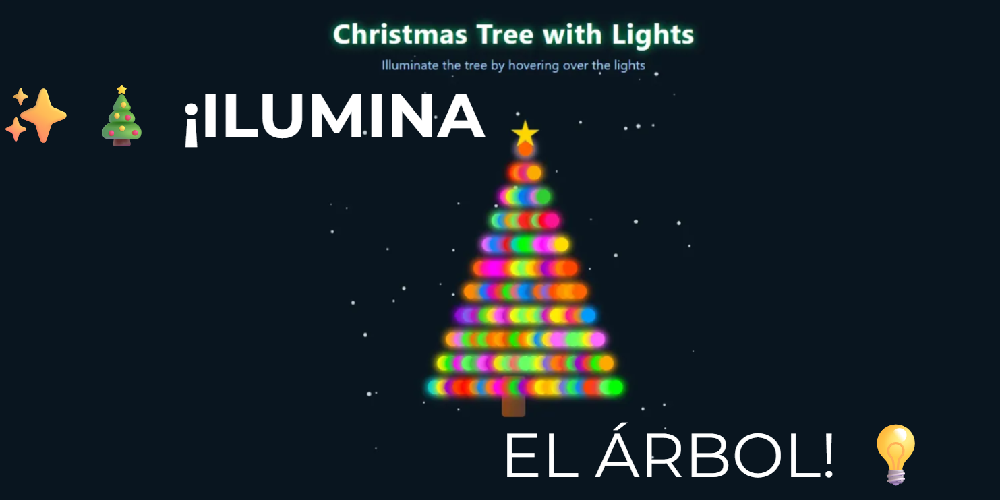

# 🎄 Árbol de Navidad Focos

Un árbol de Navidad animado con luces parpadeantes creado con **HTML, CSS y JavaScript**.

---

## 🚀 Tecnologías

- HTML5
- CSS3
- JavaScript

---

## ✨ Características

- 🎄 Árbol de Navidad animado
- 💡 Luces que parpadean
- 🌈 Colores dinámicos
- ⚡ Código ligero
- 📱 Funciona en navegador

---

## 📂 Estructura del proyecto

```
arbol-de-navidad-focos/
│
├── arbol_navidad_Focos.html
├── style.css
├── script.js
└── assets/
```

---

## ▶️ Cómo usar

Descarga el proyecto y abre **arbol_navidad_Focos.html** en tu navegador.

---

## 📸 Vista previa



---

## 👩‍💻 Autor

Desarrollado por **She Codes MX**

⭐ Si te gustó el proyecto, deja una estrella en GitHub.
